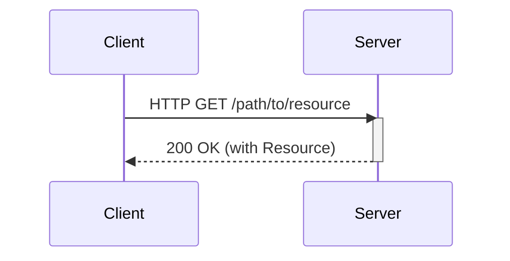
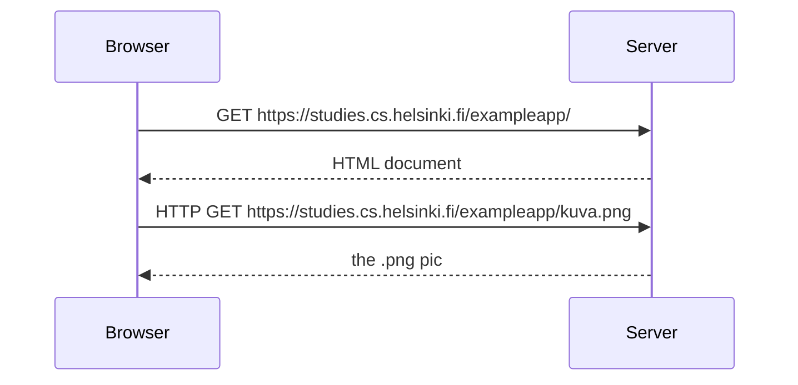

# Fullstack

## 0b [Fundamentals of Web apps](https://studies.cs.helsinki.fi/exampleapp/)

### HTTP GET



### Traditional web applications

> In traditional web applications, the browser is "dumb". It only fetches HTML data from the server, and all application logic is on the server. A server can be created using Java Spring, Python Flask or Ruby on Rails to name just a few examples.

Server: static text file || HTML code formed dynamically on the server

(this course will be using Express library with Node.js to create servers)

### Running application logic in the browser



### Event handlers and Callback functions

> Event handler functions are called callback functions. The application code does not invoke the functions itself, but the runtime environment - the browser, invokes the function at an appropriate time when the event has occurred.

### Document Object Model or DOM

> Document Object Model, or DOM, is an Application Programming Interface (API) that enables programmatic modification of the element trees corresponding to web pages.

### CSS

```css
.container {
  padding: 10px;
  border: 1px solid;
}

.notes {
  color: blue;
}
```

> The file defines two class selectors. These are used to select certain parts of the page and to define styling rules to style them.

### Forms and HTTP POST

> The Form tag has attributes action and method, which define that submitting the form is done as an HTTP POST request to the address new_note.

### AJAX (asynchronous javascript and XML)

revolutionary approach introduced in 2005 to fetch content using JavaScript included in HTML without rerendering the page

### Single page app

```css
{
  content: "single page app does not reload the whole page",
  date: "2019-05-25T15:15:59.905Z"
}
```

> The code determines that the data is to be sent with an HTTP POST request and the data type is to be JSON. The data type is determined with a Content-type header. Then the data is sent as JSON string.

### [JavaScript-libraries](/notes/webdev.md#javascript)

> The status of React seems strong, but the world of JavaScript is ever-changing. For example, recently a newcomer - VueJS - has been capturing some interest.

### Full-stack web development

> We will code the backend with JavaScript, using the Node.js runtime environment. Using the same programming language on multiple layers of the stack gives full-stack web development a whole new dimension. However, it's not a requirement of full-stack web development to use the same programming language (JavaScript) for all layers of the stack.

### JavaScript fatigue

> The world of JavaScript develops fast, which brings its own set of challenges. Tools, libraries and the language itself are under constant development. Some are starting to get tired of the constant change, and have coined a term for it: JavaScript fatigue. See How to Manage JavaScript Fatigue on auth0 or JavaScript fatigue on Medium.

## 1a Introduction to React

### Component

### JSX

It seems like React components are returning HTML markup. However, this is not the case. Under the hood, JSX returned by React components is compiled into JavaScript. JSX is "XML-like", which means that every tag needs to be closed.

### Multiple components

Indeed, a core philosophy of React is composing applications from many specialized reusable components.

Another strong convention is the idea of a root component called App at the top of the component tree of the application.

### props: passing data to components


## 1b Javascript

- During this course the use of var is ill-advised and you should stick with using const and let!
- use console.log() to test functionality

### JavaScript materials

There exist both good and poor guides for JavaScript on the Internet. Most of the links on this page relating to JavaScript features reference Mozilla's JavaScript Guide.

It is highly recommended to immediately read A re-introduction to JavaScript (JS tutorial) on Mozilla's website.

If you wish to get to know JavaScript deeply there is a great free book series on the Internet called You-Dont-Know-JS.

Another great resource for learning JavaScript is javascript.info.

The free and highly engaging book Eloquent JavaScript https://eloquentjavascript.net. Takes you from the basics to interesting stuff quickly, a mixture of theory projects and exercises, covers general programming theory as well as the JavaScript language.

egghead.io has plenty of quality screencasts on JavaScript, React, and other interesting topics. Unfortunately, some of the material is behind a paywall.

## 1c Component state, event handlers
