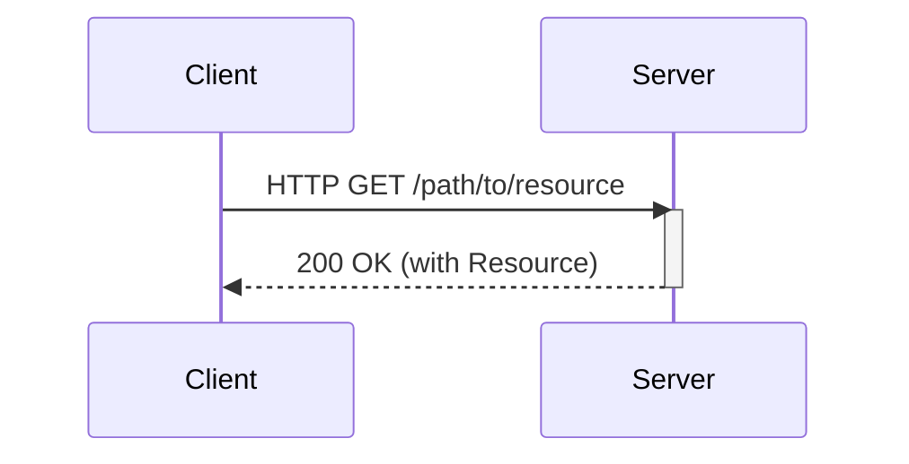
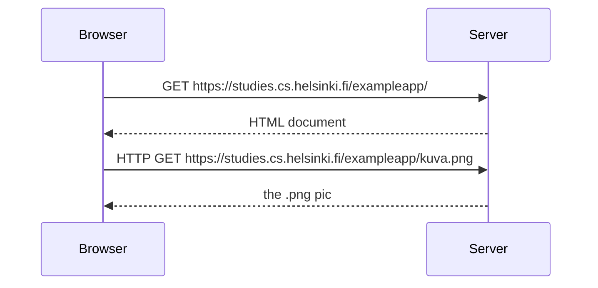

#

## 0b [Fundamentals of Web apps](https://studies.cs.helsinki.fi/exampleapp/)

### HTTP GET



### Traditional web applications

> In traditional web applications, the browser is "dumb". It only fetches HTML data from the server, and all application logic is on the server. A server can be created using Java Spring, Python Flask or Ruby on Rails to name just a few examples.

Server: static text file || HTML code formed dynamically on the server

(this course will be using Express library with Node.js to create servers)

### Running application logic in the browser



### AJAX (asynchronous javascript and XML)

revolutionary approach to fetching content using JavaScript included in HTML without rerendering the page

- a service for creating [websequencediagrams](https://www.websequencediagrams.com)
- article about [Unified Modeling Language (UML) | Sequence Diagrams](https://www.geeksforgeeks.org/unified-modeling-language-uml-sequence-diagrams/)

## 0.4: New note

```
title user creates a new note on https://studies.cs.helsinki.fi/exampleapp/notes by inserting data and pressing "save" button.

note over browser
Disabled caching to force browser
to create new HTTP GET requests
end note
browser->server: HTTP POST https://studies.cs.helsinki.fi/exampleapp/new_note
server-->browser: HTTP 302 "url redirect" > /exampleapp/notes"
browser->server: HTTP GET 200 https://studies.cs.helsinki.fi/exampleapp/notes
server-->browser: HTML-code
browser->server: HTTP GET 200 https://studies.cs.helsinki.fi/exampleapp/main.css
server-->browser: main.css
browser->server: HTTP GET 200 https://studies.cs.helsinki.fi/exampleapp/main.js
server-->browser: main.js
note over browser
browser starts executing js-code
that requests JSON data from server
end note
browser->server: HTTP GET 200 https://studies.cs.helsinki.fi/exampleapp/data.json
server-->browser: [{"content":"6666666","date":"2022-09-05T18:02:51.542Z"}, ...]
note over browser
browser executes the event handler
that render notes to display
end note
```

## 0.5: Single page app

```uml
title user goes to singe page app https://studies.cs.helsinki.fi/exampleapp/spa

note over browser
Disabled caching to force browser
to create new HTTP GET requests
end note
browser->server: HTTP GET 200 https://studies.cs.helsinki.fi/exampleapp/spa
server-->browser: HTML-code
browser->server: HTTP GET 200 https://studies.cs.helsinki.fi/exampleapp/main.css
server-->browser: main.css
browser->server: HTTP GET 200 https://studies.cs.helsinki.fi/exampleapp/spa.js
server-->browser: spa.js
browser->server: HTTP GET 200  https://studies.cs.helsinki.fi/exampleapp/data.json
server-->browser: [{"content":"joo","date":"2022-09-05T13:04:49.591Z"}, ...]
```

## 0.6: New note

```uml
title user creates a new note on https://studies.cs.helsinki.fi/exampleapp/spa by inserting data and pressing "save" button.

note over browser
Disabled caching to force browser
to create new HTTP GET requests
end note
browser->server: HTTP POST 201 https://studies.cs.helsinki.fi/exampleapp/new_note_spa
browser-->server: [{content: "test", date: "2022-09-05T18:22:38.307Z"}]
```

## 1b Javascript

- During this course the use of var is ill-advised and you should stick with using const and let!
- use console.log() to test functionality

### JavaScript materials

There exist both good and poor guides for JavaScript on the Internet. Most of the links on this page relating to JavaScript features reference Mozilla's JavaScript Guide.

It is highly recommended to immediately read A re-introduction to JavaScript (JS tutorial) on Mozilla's website.

If you wish to get to know JavaScript deeply there is a great free book series on the Internet called You-Dont-Know-JS.

Another great resource for learning JavaScript is javascript.info.

The free and highly engaging book Eloquent JavaScript https://eloquentjavascript.net. Takes you from the basics to interesting stuff quickly, a mixture of theory projects and exercises, covers general programming theory as well as the JavaScript language.

egghead.io has plenty of quality screencasts on JavaScript, React, and other interesting topics. Unfortunately, some of the material is behind a paywall.

## 1c Component state, event handlers
