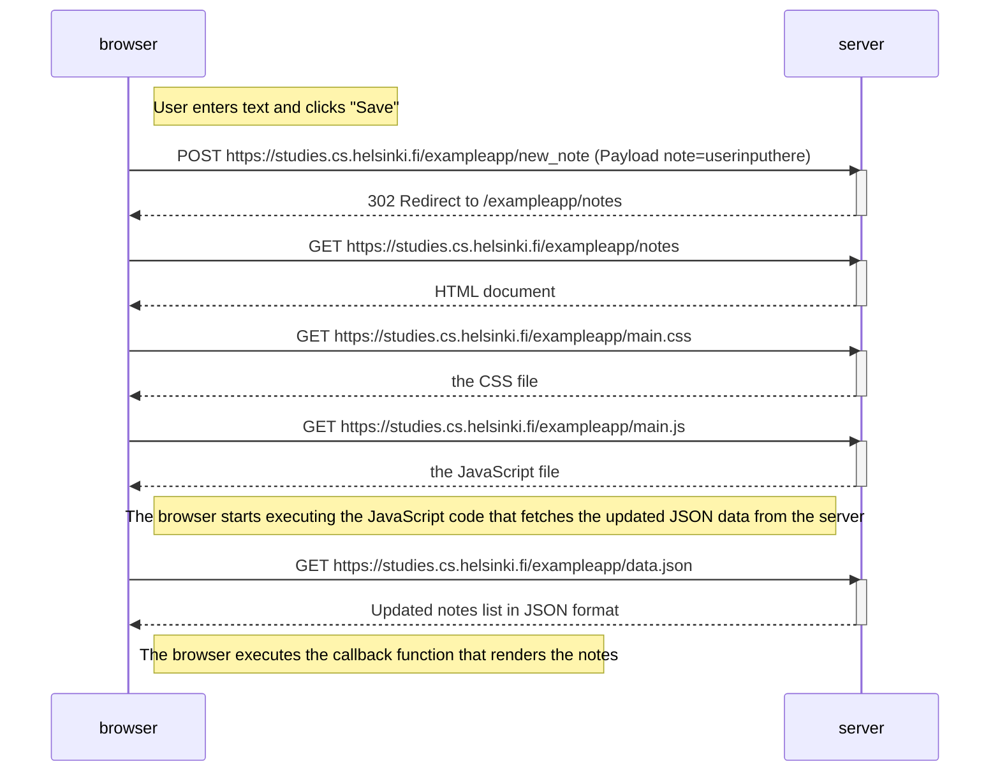
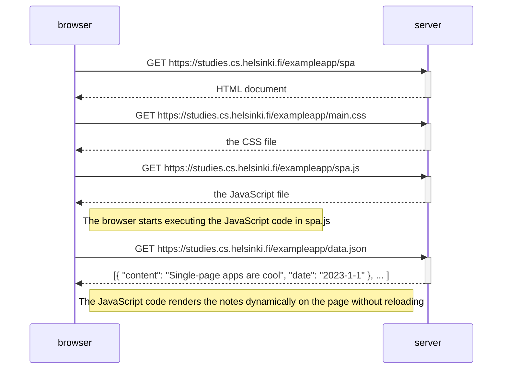
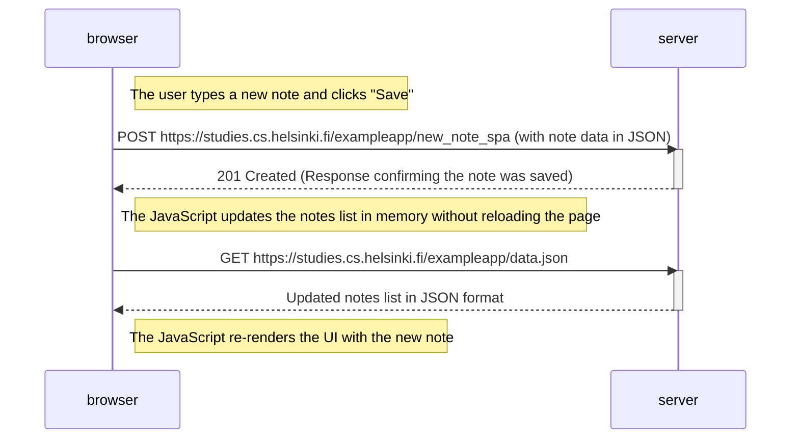

# Exercises

## 0.1: HTML

Review the basics of HTML by reading this tutorial from Mozilla: [HTML tutorial](https://developer.mozilla.org/en-US/docs/Learn/Getting_started_with_the_web/HTML_basics).

This exercise is not submitted to GitHub, it's enough to just read the tutorial

## 0.2: CSS

Review the basics of CSS by reading this tutorial from Mozilla: [CSS tutorial](https://developer.mozilla.org/en-US/docs/Learn/Getting_started_with_the_web/CSS_basics).

This exercise is not submitted to GitHub, it's enough to just read the tutorial

## 0.3: HTML forms

Learn about the basics of HTML forms by reading Mozilla's tutorial [Your first form](https://developer.mozilla.org/en-US/docs/Learn/HTML/Forms/Your_first_HTML_form).

This exercise is not submitted to GitHub, it's enough to just read the tutorial

## 0.4: New note diagram

In the section Loading a page containing JavaScript - review, the chain of events caused by opening the page https://studies.cs.helsinki.fi/exampleapp/notes is depicted as a sequence diagram

Create a similar diagram depicting the situation where the user creates a new note on the page https://studies.cs.helsinki.fi/exampleapp/notes by writing something into the text field and clicking the Save button.

## 0.5: Single page app diagram

## 0.6: New note in Single page app diagram

## 